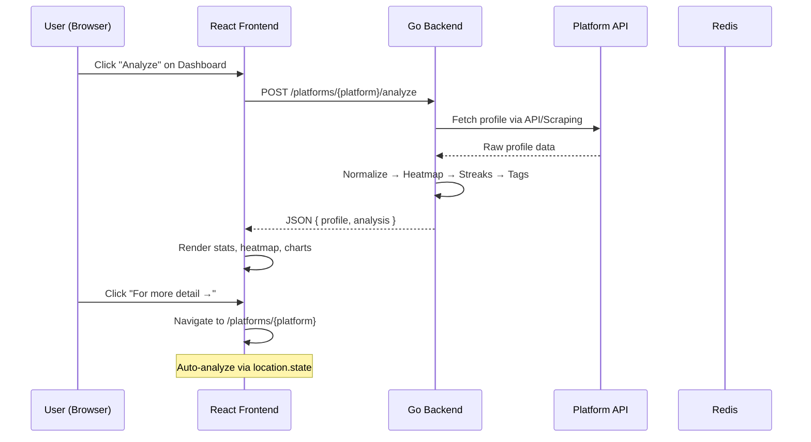
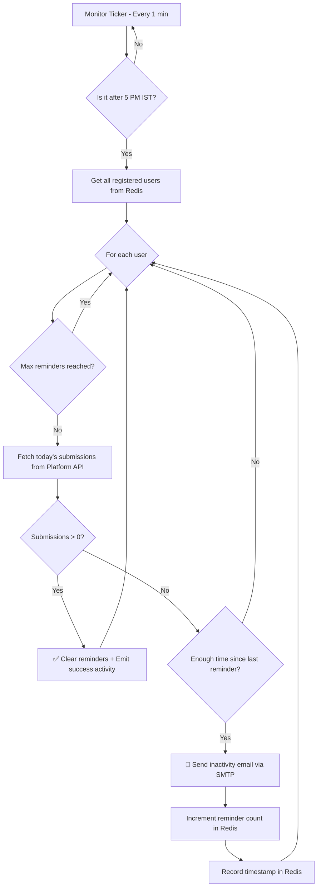
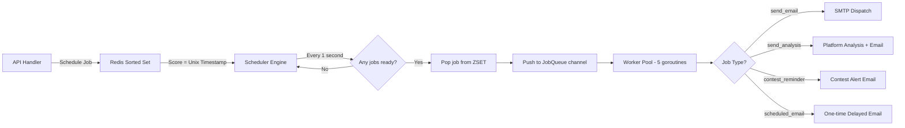
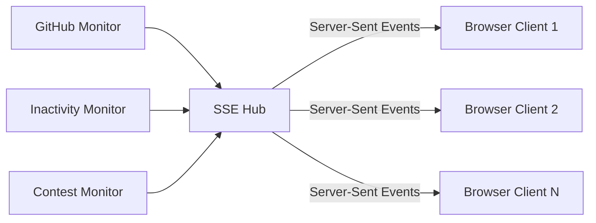

<p align="center">
  
  
  
  
  
  
</p>

<h1 align="center">🚀 DevScheduler</h1>

<p align="center">
  <strong>A real-time competitive programming intelligence dashboard with automated email reminders, multi-platform analytics, GitHub activity tracking, and a background job scheduler — all powered by Go, React, Redis & MongoDB.</strong>
</p>

<p align="center">
  <a href="#-features">Features</a> •
  <a href="#%EF%B8%8F-architecture">Architecture</a> •
  <a href="#-system-workflow">Workflow</a> •
  <a href="#-project-structure">Structure</a> •
  <a href="#-getting-started">Setup</a> •
  <a href="#-api-reference">API</a> •
  <a href="#-screenshots">Screenshots</a>
</p>

---

## ✨ Features

### 🧠 Multi-Platform Intelligence Engine
| Platform | Data Source | Features |
|----------|-----------|----------|
| **LeetCode** | GraphQL API | Problems solved, difficulty breakdown, submission calendar/heatmap, streaks, recent submissions, contest history with rating changes |
| **Codeforces** | Official REST API | Rating & rank (with color-coded tiers), tag distribution, submission calendar, streaks, contest history with Δ rating |
| **CodeChef** | Web Scraping (Colly) | Star rating, current/max rating, global & country rank, problems solved, contest history |
| **GeeksForGeeks** | Stats API + Scraping | Coding score, difficulty breakdown (easy/medium/hard), streaks, monthly coding score, institute rank |
| **GitHub** | Public Events API | Push events, pull request tracking, repo activity feed |

### 📧 Intelligent Notification System
- **Inactivity Reminders** — If you haven't solved a problem today, email reminders start at **5:00 PM IST** and repeat **every hour** (up to 8 times).
- **Contest Countdown Alerts** — Email reminders at **60, 30, 15, 5, and 1 minute** before any upcoming contest.
- **Scheduled Emails** — One-time delayed emails via the built-in job scheduler with date/time picker.
- **Deduplication** — Redis-based key strategy ensures no duplicate reminders are ever sent.

### 🏗️ Real-Time Activity Feed (SSE)
- Server-Sent Events hub broadcasts live updates to all connected clients.
- GitHub pushes, inactivity alerts, contest reminders, and analysis results appear instantly.
- Categorized feed items: `success`, `warning`, `info`, `github`.

### 🔐 Authentication
- **JWT-based** email/password signup and login.
- **Google OAuth 2.0** one-click sign-in.
- Onboarding modal to capture platform usernames on first login.

### ⚡ Background Job Scheduler
- Redis Sorted Set based job queue with Unix timestamp scoring.
- Goroutine worker pool (configurable pool size) processes jobs concurrently.
- Job types: `send_email`, `send_analysis`, `contest_reminder`, `scheduled_email`.

---

## 🏛️ Architecture

```
┌─────────────────────────────────────────────────────────────────────┐
│                         CLIENT (Browser)                            │
│  React 19 · Vite · Tailwind v4 · Framer Motion · Lucide Icons      │
└──────────────┬──────────────────────────────────┬───────────────────┘
               │  REST API (JSON)                 │  SSE Stream
               ▼                                  ▼
┌─────────────────────────────────────────────────────────────────────┐
│                      GO API SERVER (Gin)                            │
│  Port 8080 · CORS · JWT Middleware · Route Groups                   │
├─────────────────────────────────────────────────────────────────────┤
│                                                                     │
│  ┌──────────┐  ┌──────────────┐  ┌──────────────┐  ┌────────────┐ │
│  │ Handlers │  │   Services   │  │   Workers    │  │  Scheduler │ │
│  │ (REST)   │──│ (Business)   │──│ (Job Queue)  │──│  (Engine)  │ │
│  └──────────┘  └──────────────┘  └──────────────┘  └────────────┘ │
│                                                                     │
│  ┌──────────────────────┐  ┌────────────────────────────────────┐  │
│  │  Event Monitors (4)  │  │  SSE Hub (real-time broadcasting) │  │
│  │  • User Analysis     │  │  • Activity Feed                  │  │
│  │  • Contest Reminders  │  │  • GitHub Events                  │  │
│  │  • Inactivity Check  │  │  • Productivity Alerts            │  │
│  │  • GitHub Tracker    │  └────────────────────────────────────┘  │
│  └──────────────────────┘                                          │
└──────────┬──────────────────────────────┬──────────────────────────┘
           │                              │
           ▼                              ▼
┌─────────────────────┐      ┌─────────────────────┐
│    Redis (Cache)    │      │   MongoDB (Store)   │
│  • Job Queue (ZSET) │      │  • Users Collection │
│  • Activity State   │      │  • Activity Logs    │
│  • Reminder Dedup   │      │  • User Profiles    │
│  • Registered Users │      └─────────────────────┘
└─────────────────────┘

           ┌──────────────────────────────────────────┐
           │         EXTERNAL PLATFORM APIs            │
           │  • LeetCode GraphQL                       │
           │  • Codeforces REST API                    │
           │  • CodeChef (Web Scraping via Colly)      │
           │  • GeeksForGeeks (API + Scraping)         │
           │  • GitHub Public Events API               │
           │  • Gmail SMTP (Email Dispatch)             │
           └──────────────────────────────────────────┘
```

---

## 🔄 System Workflow

### 1. User Analysis Flow



### 2. Inactivity Reminder Flow



### 3. Background Job Scheduler Flow



### 4. Real-Time SSE Activity Feed



---

## 📁 Project Structure

```
DevScheduler/
├── Backend/                          # Go API Server
│   ├── main.go                       # Entry point — boots Redis, MongoDB, Router, Workers, Monitors
│   ├── .env                          # Environment variables (secrets, API keys)
│   ├── go.mod                        # Go module dependencies
│   │
│   ├── config/                       # Database connections & app config
│   │   └── db.go                     # Redis + MongoDB + env config loader
│   │
│   ├── model/                        # Data structures
│   │   ├── user.go                   # User, UserProfile, AnalysisResult, ContestInfo
│   │   ├── job.go                    # Job model for scheduler queue
│   │   └── activity.go              # Activity feed item model
│   │
│   ├── handler/                      # HTTP route handlers (controllers)
│   │   ├── auth_handler.go           # Signup, Login, Google OAuth
│   │   ├── leetcode_handler.go       # LeetCode /analyze, /profile, /heatmap, /submissions, /contests
│   │   ├── codeforces_handler.go     # Codeforces /analyze
│   │   ├── codechef_handler.go       # CodeChef /analyze
│   │   ├── gfg_handler.go           # GeeksForGeeks /analyze
│   │   ├── job_handler.go           # Register user, fetch analysis, platform profiles
│   │   ├── activity_handler.go      # GET /activities, SSE /activities/stream
│   │   ├── email_handler.go         # Direct email dispatch
│   │   ├── schedule_email_handler.go # Schedule delayed emails
│   │   └── user_handler.go          # User profile management
│   │
│   ├── services/                     # Business logic layer
│   │   ├── leetcode_service.go       # LeetCode GraphQL: profile, calendar, submissions, contests
│   │   ├── codeforces_service.go     # Codeforces API: user.info, user.status, user.rating
│   │   ├── codechef_service.go       # CodeChef web scraping with Colly
│   │   ├── gfg_service.go           # GFG stats API + Colly scraping fallback
│   │   ├── github.go                # GitHub public events API
│   │   ├── platform_service.go      # Unified platform dispatcher
│   │   ├── analysis_service.go      # Intelligent analysis engine (tiers, messages)
│   │   ├── contest_service.go       # Upcoming contest schedule generator
│   │   ├── email_service.go         # SMTP email dispatch (Gmail)
│   │   ├── email_templates.go       # Rich email templates (inactivity, contest, etc.)
│   │   ├── activity_service.go      # Activity CRUD + SSE emission
│   │   ├── sse_hub.go               # Server-Sent Events connection hub
│   │   ├── redis_keys.go            # Redis key strategy + deduplication helpers
│   │   ├── auth_service.go          # JWT + bcrypt authentication
│   │   ├── google_auth_service.go   # Google OAuth token verification
│   │   └── message_service.go       # Dynamic motivational message generator
│   │
│   ├── workers/                      # Background job processing
│   │   ├── worker.go                 # Worker pool manager (goroutine pool)
│   │   ├── payloads.go              # Job payload type definitions
│   │   ├── email.go                 # Email job processor
│   │   ├── leetcode.go              # LeetCode analysis job processor
│   │   ├── codechef.go              # CodeChef analysis job processor
│   │   ├── analysis_worker.go       # General analysis worker
│   │   └── notification_worker.go   # Notification dispatch worker
│   │
│   ├── scheduler/                    # Job scheduler engine
│   │   └── engine.go                 # Redis ZSET poller → JobQueue channel
│   │
│   ├── events/                       # Background event monitors
│   │   ├── mointor.go               # 4 goroutine monitors (analysis, contest, inactivity, GitHub)
│   │   └── event_handler.go         # Event processing logic (emails, activities)
│   │
│   ├── middleware/                    # HTTP middleware
│   │   └── auth.go                   # JWT authentication middleware
│   │
│   └── repository/                   # Database access layer
│       └── user_repository.go        # MongoDB CRUD for users
│
└── Frontend/                         # React SPA
    ├── index.html                    # HTML entry point
    ├── vite.config.js                # Vite build configuration
    ├── package.json                  # npm dependencies
    │
    └── src/
        ├── main.jsx                  # React DOM root
        ├── App.jsx                   # Router + protected routes + auth state
        ├── index.css                 # Global styles + Tailwind v4 directives
        │
        ├── pages/
        │   ├── Dashboard.jsx         # Main hub — analysis, stats, activity feed
        │   ├── LeetCodePage.jsx      # LeetCode intelligence (heatmap, submissions, contests)
        │   ├── CodeforcesPage.jsx    # Codeforces intelligence (rank colors, tags, rating Δ)
        │   ├── CodeChefPage.jsx      # CodeChef intelligence (stars, global rank, contests)
        │   ├── GFGPage.jsx           # GeeksForGeeks intelligence (score, difficulty breakdown)
        │   ├── Contests.jsx          # Live contest countdowns
        │   ├── Schedule.jsx          # Email scheduler with date/time picker
        │   ├── Watch.jsx             # Watched handles management
        │   ├── Profile.jsx           # User profile editor
        │   ├── Login.jsx             # Login page (email + Google OAuth)
        │   └── Signup.jsx            # Registration page
        │
        ├── components/
        │   ├── Navbar.jsx            # Navigation with platform dropdown
        │   ├── ActivityFeed.jsx      # Real-time SSE activity feed
        │   ├── ActivityItem.jsx      # Individual feed item with icons
        │   ├── ContestCountdown.jsx  # Live countdown timer component
        │   ├── StatsCard.jsx         # Animated stat display card
        │   ├── TierBadge.jsx         # Performance/rating tier badge
        │   ├── HealthIndicator.jsx   # API health status dot
        │   ├── ActionButton.jsx      # Gradient CTA button
        │   ├── GoogleAuthButton.jsx  # Google sign-in button
        │   ├── OnboardingModal.jsx   # First-login setup wizard
        │   ├── LogoutButton.jsx      # Session clear + redirect
        │   └── AuthFormStyles.jsx    # Shared auth form styling
        │
        ├── services/
        │   └── api.js                # Centralized API client (REST + auth headers)
        │
        └── utils/
            └── auth.js               # JWT storage, profile helpers, session management
```

---

## 🚀 Getting Started

### Prerequisites

| Tool | Version | Purpose |
|------|---------|---------|
| **Go** | ≥ 1.21 | Backend API server |
| **Node.js** | ≥ 18 | Frontend build tooling |
| **Redis** | ≥ 7.0 | Job queue, caching, deduplication |
| **MongoDB** | ≥ 6.0 | User storage, activity logs |

### 1. Clone the Repository

```bash
git clone https://github.com/YOUR_USERNAME/DevFlow.git
cd DevFlow
```

### 2. Backend Setup

```bash
cd Backend

# Install Go dependencies
go mod tidy

# Create your .env file
cp .env.example .env
# Edit .env with your credentials (see Environment Variables below)

# Start Redis (in a separate terminal)
redis-server

# Start MongoDB (in a separate terminal)
mongod

# Run the server
go run main.go
```

The server will start on `http://localhost:8080`.

### 3. Frontend Setup

```bash
cd Frontend

# Install dependencies
npm install

# Start development server
npm run dev
```

The frontend will start on `http://localhost:5173`.

### Environment Variables

Create a `.env` file in `Backend/` with the following:

```env
# ── Core ────────────────────────────────────────
EMAIL_SENDER=your-email@gmail.com
EMAIL_PASSWORD=your-app-password          # Gmail App Password (not your login password)
JWT_SECRET=your-super-secret-key
MONGO_URI=mongodb://localhost:27017/devscheduler

# ── Google OAuth ────────────────────────────────
GOOGLE_CLIENT_ID=your-google-client-id

# ── AI (Optional — for future features) ────────
AI_PROVIDER=gemini
GEMINI_API_KEY=your-gemini-api-key
AI_MODEL=gemini-1.5-flash

# ── RAG / Vector DB (Optional) ─────────────────
PINECONE_API_KEY=your-pinecone-key
PINECONE_INDEX_URL=your-pinecone-url
EMBEDDING_PROVIDER=gemini
EMBEDDING_MODEL=text-embedding-004
EMBEDDING_DIM=768
RAG_TOP_K=5
```

> **Note:** For Gmail, you need to generate an [App Password](https://myaccount.google.com/apppasswords) (requires 2FA enabled).

---

## 📡 API Reference

### Authentication

| Method | Endpoint | Auth | Description |
|--------|----------|------|-------------|
| `POST` | `/signup` | ❌ | Register with email & password |
| `POST` | `/login` | ❌ | Login → JWT token |
| `POST` | `/auth/google` | ❌ | Google OAuth sign-in |

### Platform Intelligence

| Method | Endpoint | Auth | Description |
|--------|----------|------|-------------|
| `POST` | `/platforms/leetcode/analyze` | ✅ | Full LeetCode profile analysis |
| `POST` | `/platforms/codeforces/analyze` | ✅ | Full Codeforces profile analysis |
| `POST` | `/platforms/codechef/analyze` | ✅ | Full CodeChef profile analysis |
| `POST` | `/platforms/gfg/analyze` | ✅ | Full GeeksForGeeks profile analysis |
| `GET` | `/platforms/leetcode/profile` | ❌ | LeetCode profile data |
| `GET` | `/platforms/leetcode/heatmap` | ❌ | Submission calendar + streaks |
| `GET` | `/platforms/leetcode/submissions` | ❌ | Recent submission list |
| `GET` | `/platforms/leetcode/contests` | ❌ | Contest history + ratings |

### User Management

| Method | Endpoint | Auth | Description |
|--------|----------|------|-------------|
| `POST` | `/register/:platform/:username` | ✅ | Register handle for monitoring |
| `POST` | `/user/profile` | ✅ | Update user profile |
| `GET` | `/users` | ❌ | List all registered users |

### Activity Feed

| Method | Endpoint | Auth | Description |
|--------|----------|------|-------------|
| `GET` | `/activities` | ❌ | Fetch activity history |
| `GET` | `/activities/stream` | ❌ | SSE real-time stream |
| `POST` | `/activities/:id/read` | ✅ | Mark activity as read |
| `POST` | `/activities/clear` | ✅ | Clear all activities |

### Scheduler

| Method | Endpoint | Auth | Description |
|--------|----------|------|-------------|
| `POST` | `/schedule-email` | ✅ | Schedule a delayed email |
| `GET` | `/contests/:platform` | ❌ | Get upcoming contests |

---

## ⚙️ Redis Key Strategy

DevFlow uses Redis extensively for state management and deduplication:

```
Key Pattern                                      │ Purpose
─────────────────────────────────────────────────┼──────────────────────────
registered_user:{platform}:{username}            │ Stores user email
user_activity:{platform}:{username}              │ Last known solve count
inactivity_count:{platform}:{username}           │ Reminders sent today (0-8)
inactivity_date:{platform}:{username}            │ Current tracking date
last_reminder_sent:{platform}:{username}         │ Unix timestamp of last email
contest_reminder_sent:{platform}:{contest}:{min} │ Dedup flag per countdown slot
github_last_event:{username}                     │ Last processed GitHub event ID
jobs (Sorted Set)                                │ Scheduled jobs (score = timestamp)
```

---

## 🎨 Design Philosophy

- **Premium SaaS Aesthetic** — Amber/orange brand palette, glassmorphism cards, smooth Framer Motion transitions.
- **Platform-Specific Theming** — Each platform page has its own gradient accent:
  - 🟠 LeetCode → Orange/Amber
  - 🔵 Codeforces → Blue/Cyan
  - 🟡 CodeChef → Gold/Amber
  - 🟢 GeeksForGeeks → Green/Emerald
- **Collapsible Sections** — Recent Submissions and Contest History default to collapsed state for a clean UI.
- **Deep Linking** — Dashboard analysis results link directly to platform pages with auto-analyze state propagation.

---

## 🔧 Tech Stack

### Backend
| Technology | Usage |
|------------|-------|
| **Go (Gin)** | REST API framework |
| **Redis** | Job queue, caching, state management |
| **MongoDB** | User storage, activity persistence |
| **Colly** | Web scraping (CodeChef, GFG) |
| **JWT** | Authentication tokens |
| **bcrypt** | Password hashing |
| **Gmail SMTP** | Email dispatch |
| **SSE** | Real-time activity broadcasting |

### Frontend
| Technology | Usage |
|------------|-------|
| **React 19** | UI framework |
| **Vite 5** | Build tool & dev server |
| **Tailwind CSS v4** | Utility-first styling |
| **Framer Motion** | Animations & transitions |
| **Lucide React** | Icon library |
| **React Router v6** | Client-side routing |

---

## 📊 Monitoring Configuration

| Parameter | Value | Location |
|-----------|-------|----------|
| Inactivity check start | 5:00 PM IST | `events/mointor.go` |
| Reminder interval | Every 60 minutes | `services/redis_keys.go` |
| Max reminders per day | 8 | `services/redis_keys.go` |
| User analysis frequency | Every 5 minutes | `events/mointor.go` |
| Contest check frequency | Every 1 minute | `events/mointor.go` |
| GitHub polling interval | Every 10 minutes | `events/mointor.go` |
| Worker pool size | 5 goroutines | `main.go` |
| Scheduler poll interval | Every 1 second | `scheduler/engine.go` |

---

## 🤝 Contributing

1. Fork the repository
2. Create a feature branch (`git checkout -b feature/amazing-feature`)
3. Commit your changes (`git commit -m 'Add amazing feature'`)
4. Push to the branch (`git push origin feature/amazing-feature`)
5. Open a Pull Request

---

## 📄 License

This project is licensed under the MIT License — see the [LICENSE](LICENSE) file for details.

---

<p align="center">
  <strong>Built with ❤️ by <a href="https://github.com/YOUR_USERNAME">Soham</a></strong>
</p>

<p align="center">
  <sub>If you found this project helpful, please consider giving it a ⭐!</sub>
</p>
